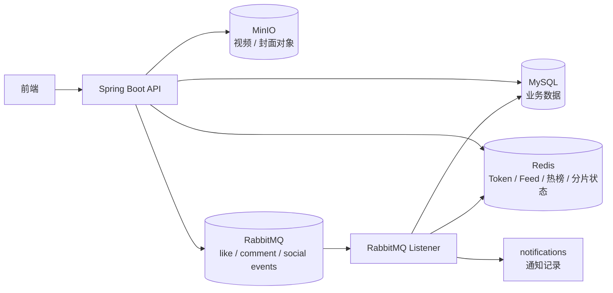
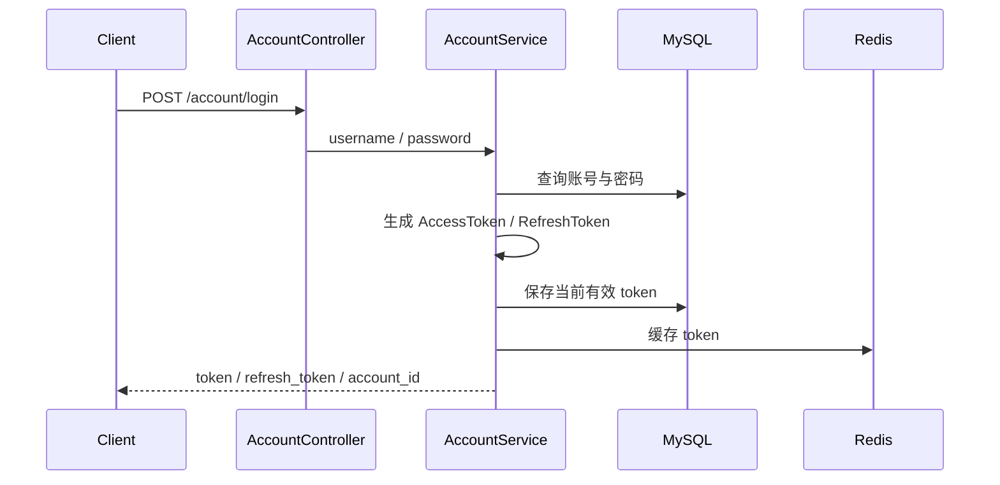
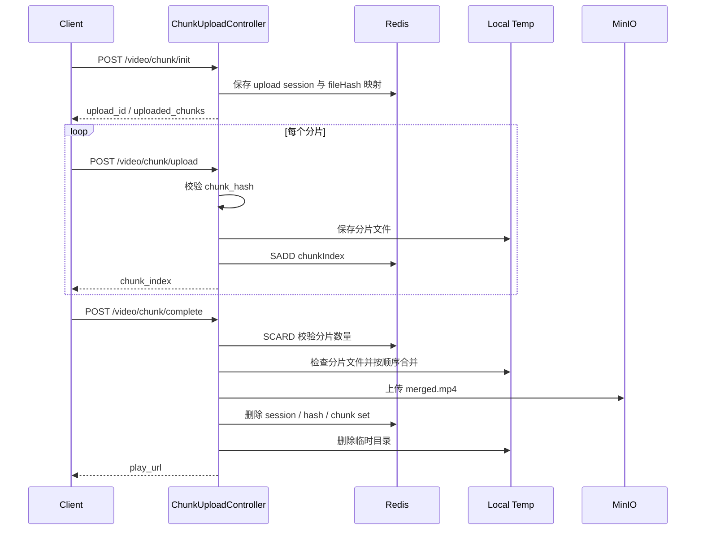
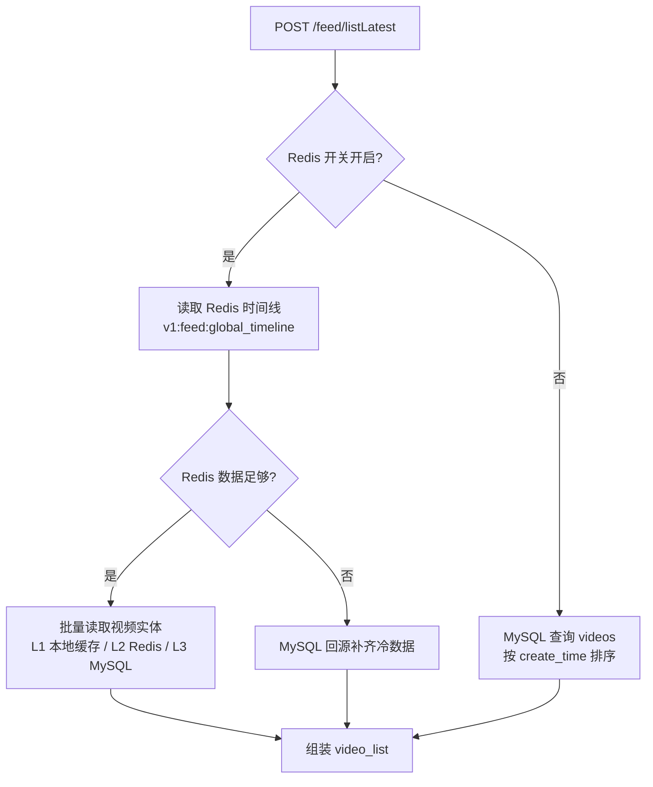
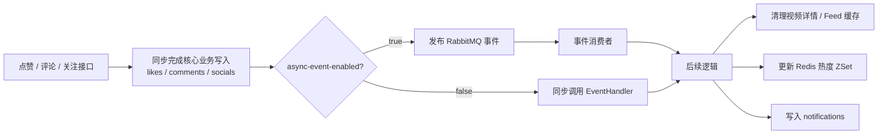

# FeedSystem Java 后端

## 项目介绍

FeedSystem 是一个短视频 Feed 系统后端项目，基于 Spring Boot 实现账号、视频、分片上传、Feed 流、点赞、评论、关注、私信、通知等功能。

## 技术栈

| 类型 | 技术 |
| --- | --- |
| 开发语言 | Java 17 |
| Web 框架 | Spring Boot 3.5 |
| 数据访问 | MyBatis |
| 数据库 | MySQL |
| 缓存 | Redis |
| 消息队列 | RabbitMQ |
| 对象存储 | MinIO |
| 鉴权 | JWT |
| 构建工具 | Maven |

## 核心功能

- **账号与鉴权**：支持注册、登录、Token 刷新、登出、改名、修改密码、个人资料更新等功能；使用 JWT 做接口鉴权，并通过 Redis 缓存 Token，减少数据库查询。

- **视频上传与对象存储**：支持视频和封面上传，文件存储到 MinIO，数据库只保存 objectKey，返回给前端时再转换为可访问 URL；支持大文件分片上传、断点续传、分片 MD5 校验、完整文件 hash 校验，上传完成后合并分片并上传到 MinIO。

- **Feed 流与榜单**：支持推荐流、关注流、点赞榜、热榜和话题查询。推荐流按发布时间排序，热点数据走 Redis 时间线，冷数据回源 MySQL；点赞榜按 `likes_count` 排序；热榜基于 Redis ZSet 统计近 60 分钟热度，Redis 无数据时回退 MySQL。

- **互动与异步事件**：支持点赞、取消点赞、评论发布、评论删除、关注、取关等互动操作；使用 RabbitMQ 处理点赞、评论、关注事件，将通知生成、视频热度更新、缓存刷新等后续逻辑从主业务中解耦。

- **私信与通知**：支持私信发送和会话列表查询；点赞、评论、关注等事件会生成通知记录，通知表使用 `recipient_id`、`sender_id`、`target_id` 表示接收者、发送者和目标对象。

## 整体架构



说明：当前 Java 版本是单体 Spring Boot 应用，API 和 RabbitMQ Consumer 在同一个进程中。RabbitMQ 主要用于解耦后续逻辑和提供失败隔离，后续可以继续拆分为独立 Worker。

## 核心流程图

### 账号登录与鉴权



### 视频分片上传



### Feed 查询



### 点赞 / 评论 / 关注事件



## 模块说明

| 模块 | 说明 |
| --- | --- |
| account | 账号注册、登录、JWT 鉴权、Token 缓存 |
| video | 视频上传、封面上传、视频发布、视频详情 |
| video/chunk | 分片上传、状态查询、分片合并、MinIO 上传 |
| feed | 推荐流、关注流、点赞榜、热榜、话题流 |
| like | 点赞、取消点赞、是否点赞、点赞列表 |
| comment | 评论发布、评论删除、评论列表 |
| social | 关注、取关、粉丝列表、关注列表 |
| message | 私信发送、私信列表 |
| notification | 通知写入与通知事件处理 |
| storage | MinIO 存储封装 |

## 数据表设计

| 表名 | 说明 |
| --- | --- |
| accounts | 用户账号表 |
| videos | 视频信息表 |
| likes | 点赞关系表 |
| comments | 评论表 |
| socials | 关注关系表 |
| messages | 私信消息表 |
| notifications | 通知表 |
| tags | 话题标签表 |
| video_tags | 视频与标签关联表 |
| outbox_msgs | 视频发布 Outbox 消息表 |

### accounts

用户账号表，保存登录凭证、当前有效 Token 和用户资料。

| 字段 | 说明 |
| --- | --- |
| id | 用户 ID |
| username | 用户名，唯一 |
| password | 加密后的密码 |
| token | 当前有效 AccessToken |
| refresh_token | 当前有效 RefreshToken |
| avatar_url | 头像地址 |
| bio | 个人简介 |

### videos

视频信息表，保存视频元数据、作者信息和统计字段。

| 字段 | 说明 |
| --- | --- |
| id | 视频 ID |
| author_id | 作者账号 ID |
| username | 作者用户名 |
| title | 视频标题 |
| description | 视频描述 |
| play_url | 视频 objectKey |
| cover_url | 封面 objectKey |
| create_time | 发布时间 |
| likes_count | 点赞数，用于点赞榜排序 |
| popularity | 热度值，用于热榜回退排序 |

### likes

点赞关系表，记录用户对视频的点赞关系。

| 字段 | 说明 |
| --- | --- |
| id | 点赞记录 ID |
| video_id | 视频 ID |
| account_id | 点赞用户 ID |
| created_at | 点赞时间 |

### comments

评论表，记录视频评论内容。

| 字段 | 说明 |
| --- | --- |
| id | 评论 ID |
| username | 评论用户名称 |
| video_id | 视频 ID |
| author_id | 评论用户 ID |
| content | 评论内容 |
| created_at | 评论时间 |

### socials

关注关系表，记录用户之间的关注关系。

| 字段 | 说明 |
| --- | --- |
| id | 关注记录 ID |
| follower_id | 关注者 ID |
| vlogger_id | 被关注者 ID |

### messages

私信表，记录用户之间的私信消息。

| 字段 | 说明 |
| --- | --- |
| id | 私信 ID |
| from_id | 发送者 ID |
| to_id | 接收者 ID |
| content | 私信内容 |
| is_read | 是否已读 |
| created_at | 发送时间 |

### notifications

通知表，记录点赞、评论、关注等互动事件产生的通知。

| 字段 | 说明 |
| --- | --- |
| id | 通知 ID |
| recipient_id | 接收通知的用户 ID |
| sender_id | 触发通知的用户 ID |
| type | 通知类型，如 like、comment、mention、follow |
| target_id | 通知目标 ID，通常是视频 ID 或用户 ID |
| content | 通知内容 |
| is_read | 是否已读 |
| created_at | 创建时间 |

### tags / video_tags

`tags` 保存话题标签，`video_tags` 保存视频和标签之间的多对多关系。

| 表名 | 字段 | 说明 |
| --- | --- | --- |
| tags | id | 标签 ID |
| tags | name | 标签名称，唯一 |
| video_tags | id | 关联记录 ID |
| video_tags | video_id | 视频 ID |
| video_tags | tag_id | 标签 ID |

### outbox_msgs

Outbox 消息表，用于记录视频发布后需要异步处理的事件。

| 字段 | 说明 |
| --- | --- |
| id | 消息 ID |
| video_id | 视频 ID |
| event_type | 事件类型 |
| create_time | 创建时间 |
| status | 消息状态 |

## Redis 使用

| 场景 | 数据结构 | 说明 |
| --- | --- | --- |
| Token 缓存 | String | 缓存 AccessToken、RefreshToken |
| 推荐流时间线 | ZSet | 保存最近视频发布时间线 |
| 热榜统计 | ZSet | 按分钟记录视频热度增量 |
| 视频详情缓存 | String | 缓存视频详情，减少数据库查询 |
| 关注流缓存 | String | 缓存当前用户关注作者的视频流 |
| 分片上传状态 | String / Set | Session 元数据使用 String，已上传分片使用 Set |
| 接口限流 | String | 评论、点赞、关注等写接口限流计数 |

分片上传中，已上传分片使用 Redis Set 记录：

```text
v1:chunk_upload_chunks:{uploadId}
```

每个分片上传成功后执行类似：

```text
SADD v1:chunk_upload_chunks:{uploadId} {chunkIndex}
```

这样可以避免并发上传时多个请求同时覆盖同一份 Session JSON，保证分片进度记录正确。

## RabbitMQ 使用

| 业务 | Exchange | Routing Key | 说明 |
| --- | --- | --- | --- |
| 点赞 | `like.events` | `like.like` / `like.unlike` | 更新热度、清理缓存、生成通知 |
| 评论 | `comment.events` | `comment.publish` / `comment.delete` | 更新热度、清理缓存、生成通知 |
| 关注 | `social.events` | `social.follow` / `social.unfollow` | 清理关注流缓存、生成通知 |
| 死信 | `dlx.events` | `#` | 失败消息进入死信队列 |

当前 Java 版本仍是单体 Spring Boot 应用，API 和 RabbitMQ Consumer 在同一个进程中。RabbitMQ 的主要作用是解耦后续逻辑、提供失败隔离和后续拆分 Worker 的基础。

## 本地启动

启动项目前，需要先准备：

- MySQL
- Redis
- RabbitMQ
- MinIO

默认端口：

| 服务 | 地址 |
| --- | --- |
| 后端 | `http://localhost:8080` |
| MySQL | `localhost:3307/feedsystem` |
| Redis | `localhost:6379` |
| RabbitMQ | `localhost:5672` |
| MinIO | `http://localhost:9000` |

启动项目：

```powershell
.\mvnw.cmd spring-boot:run
```

运行测试：

```powershell
.\mvnw.cmd test
```

## 接口概览

### 账号

| 方法 | 路径 | 说明 |
| --- | --- | --- |
| POST | `/account/register` | 注册 |
| POST | `/account/login` | 登录 |
| POST | `/account/refresh` | 刷新 Token |
| POST | `/account/logout` | 登出 |
| POST | `/account/rename` | 改名 |
| PATCH | `/account/password` | 修改密码 |
| PATCH | `/account/updateProfile` | 更新资料 |
| GET | `/account/profile` | 当前用户资料 |

### 视频

| 方法 | 路径 | 说明 |
| --- | --- | --- |
| POST | `/video/uploadVideo` | 普通视频上传 |
| POST | `/video/uploadCover` | 封面上传 |
| POST | `/video/publish` | 发布视频 |
| POST | `/video/delete` | 删除视频 |
| POST | `/video/listByAuthorID` | 作者视频列表 |
| POST | `/video/getDetail` | 视频详情 |

### 分片上传

| 方法 | 路径 | 说明 |
| --- | --- | --- |
| POST | `/video/chunk/init` | 初始化上传会话 |
| POST | `/video/chunk/upload` | 上传单个分片 |
| POST | `/video/chunk/status` | 查询已上传分片 |
| POST | `/video/chunk/complete` | 合并分片并上传 MinIO |

### Feed

| 方法 | 路径 | 说明 |
| --- | --- | --- |
| POST | `/feed/listLatest` | 推荐流/最新流 |
| POST | `/feed/listLikesCount` | 点赞榜 |
| POST | `/feed/listByFollowing` | 关注流 |
| POST | `/feed/listByPopularity` | 热榜 |
| POST | `/feed/listByTag` | 话题流 |

### 互动

| 方法 | 路径 | 说明 |
| --- | --- | --- |
| POST | `/like/like` | 点赞 |
| POST | `/like/unlike` | 取消点赞 |
| POST | `/like/isLiked` | 是否点赞 |
| POST | `/like/listMyLikedVideos` | 我的点赞列表 |
| POST | `/comment/publish` | 发布评论 |
| POST | `/comment/delete` | 删除评论 |
| POST | `/comment/listAll` | 评论列表 |
| POST | `/social/follow` | 关注 |
| POST | `/social/unfollow` | 取关 |
| POST | `/social/getAllFollowers` | 粉丝列表 |
| POST | `/social/getAllVloggers` | 关注列表 |
| POST | `/social/getCounts` | 关注统计 |

### 私信

| 方法 | 路径 | 说明 |
| --- | --- | --- |
| POST | `/message/send` | 发送私信 |
| POST | `/message/list` | 查询会话消息 |
